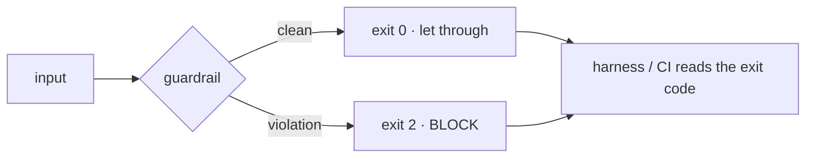

# guardianes-verificados-ia
### Who tests the guardrails? · ¿Quién vigila a los guardianes?

> A guardrail that has never blocked anything has never been shown to protect
> anything. This is a tiny, dependency-free harness that puts **guardrails
> themselves** under test — an exit-code contract, banks proven in red, and
> **mutation testing** — with **five real incidents** you can reproduce.
>
> Un guardarraíl que nunca ha bloqueado nada no ha demostrado que proteja nada.
> Este es un harness mínimo, sin dependencias, que pone a examen **a los propios
> guardianes**: un contrato de códigos de salida, bancos probados en rojo y
> **mutation testing**, con **cinco incidentes reales** que puedes reproducir.

```
pip install -e .           # optional; the repo also runs with plain `python`
python demo_rojo_verde.py  # the five incidents, red before green
python run_tests.py        # bank + red proofs + mutation score
python -m guardianes mutar # mutation testing, straight from the CLI
```

---

## EN

Most "guardrail" projects check the *output* of a model. This one checks the
**guardrails**. The idea is one level up (meta): a detector that can only *print*
"violation" but always exits 0 protects nothing, because the harness around it
reads the **exit code**, not the prose.

### The contract



The harness trusts the **exit code**, so a guardrail that forgets to translate a
violation into a non-zero exit is invisibly broken. This repo makes that
failure — and four more — reproducible.

### The five incidents (`demo_rojo_verde.py`)

Each is shown failing (**RED**) *before* it passes (**GREEN**):

| # | Incident | The bug | The fix |
|---|----------|---------|---------|
| 1 | The guardrail that never braked | a shell wrapper swallowed the child exit code → a real violation reported as "passed" | check the guardrail **end to end**, wrapper included |
| 2 | The toothless verdict | health check printed `ENFERMO` and still exited 0 | wire the verdict to the **exit code** |
| 3 | The bank that lied | test cases lifted from the detector's own rules stay green while its hole stays open | add **independent** cases |
| 4 | The guardrail on the wrong door | a hook guarded a *name/matcher*, but the resource had another door ("we counted 5, there were 6") | guard the **canonical resource**, not the name |
| 5 | The green-but-blind verdict | a freshness check compared a value against a copy of itself → green by construction | compare against an **independent** source |

Incidents 1, 2 and 5 are miniatures of failures with dates in a real system;
4 is the shape of a real security finding. Names and data are synthetic.

### Mutation testing — practice what we preach

A test suite that survives a deliberately broken program proves nothing
(Lipton 1971; `pitest`). So this repo doesn't just *say* the bank has teeth — it
**mutates the guardrails and demands the bank kills every mutant**:

```
python -m guardianes mutar     # → mutation score: 11/11
```

Two operator families: **behavioural** (inject a broken wire — blind guardrail,
toothless verdict, wrong-door guard, self-comparing freshness…) and
**source-level** (rewrite `guardian_hook.py` via `ast`: flip an exit-code
constant, negate the detector). A **surviving mutant is a hole in the bank**, and
it is reported loudly. (Equivalent mutants — e.g. mutating CLI arg-slicing, which
cannot change a verdict — are deliberately out of scope; that is standard
practice, not score-gaming.)

### What's inside

| File | Role |
|------|------|
| `guardianes/guardian_hook.py` | a guardrail as a hook, `exit 0 / exit 2` contract |
| `guardianes/salud_minima.py` | a health orchestrator whose global verdict has teeth |
| `guardianes/verificador_guardianes.py` | the meta-level: demands the contract end to end |
| `guardianes/guardian_recurso.py` | guard the resource, not the name |
| `guardianes/guardian_frescura.py` | compare against an independent source |
| `guardianes/banco.py` | a reusable bank, **proven in red** (every wire is an injection point) |
| `guardianes/mutador.py` | mutation testing (behavioural + AST source-level) |
| `guardianes/vigilancia_diaria.py` | the unattended daily watch (marker + notice) |
| `guardianes/__main__.py` | CLI: `verificar · banco · mutar · vigilar` |
| `demo_rojo_verde.py` | the five incidents, red before green |
| `run_tests.py` / `tests/` | bank + red proofs + mutation score |

_Standard library only. No network, no secrets, no third-party dependencies._

### Prior art / genealogy

Stands on **deterministic hooks** (control by code, not by an LLM) and
**mutation testing** — the ~50-year-old idea that *a test that never fails proves
nothing*. The closest relatives validate with an LLM; here the validator is plain
code. This does not claim novelty; it demonstrates a method, honestly framed.

---

## ES

La mayoría de los proyectos de "guardarraíles" comprueban la *salida* de un
modelo. Este comprueba **a los guardarraíles**. La idea está un nivel por encima:
un detector que solo *imprime* "violación" pero siempre sale con código 0 no
protege nada, porque el harness que lo rodea lee el **código de salida**, no el
texto.

**El contrato:** `exit 0` = limpio, pasa · `exit 2` = violación, BLOQUEA. El
harness confía en el código de salida; un guardián que olvida traducir la
violación a un código distinto de 0 está roto sin que se note.

**Los cinco incidentes** (`python demo_rojo_verde.py`), cada uno en ROJO antes
que VERDE: (1) el envoltorio que se traga el exit code · (2) el veredicto que
imprime ENFERMO y sale 0 · (3) el banco con casos copiados de las propias reglas
(verde con el agujero abierto) · (4) el guardián en la puerta equivocada
("contamos 5 puertas, había 6") · (5) el veredicto verde-pero-ciego que se
compara consigo mismo.

**Mutation testing** (`python -m guardianes mutar` → 11/11): el repo no *dice* que
el banco tiene dientes, lo **demuestra** mutando los guardianes y exigiendo que el
banco mate a cada mutante. Un mutante superviviente es un agujero del banco, y se
reporta. Practica lo que predica.

_Solo biblioteca estándar. Sin red, sin secretos, sin dependencias._

<!-- TODO antes de publicar / before publishing:
     - LICENSE (MIT recomendado, pendiente de OK) + campo license en pyproject
     - checklist de seguridad (grep rutas/credenciales/nombres reales)
     - decidir si se nombran fechas concretas de los incidentes (recomendado sí, verificadas) -->
