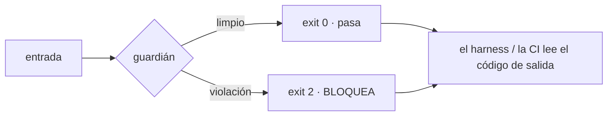

# guardianes-verificados-ia
### ¿Quién vigila a los guardianes?

Casi todas las herramientas de "guardarraíles" para IA comprueban lo que sale del modelo. Esta comprueba **los guardarraíles**. Está un nivel por encima: si un detector encuentra un problema pero no lo bloquea, no protege nada, por muy bien que lo detecte.

La razón es sencilla. El sistema que rodea a un guardián no lee su texto, lee su **código de salida**. Un `0` quiere decir "limpio, pasa". Un `2` quiere decir "hay una violación, bloquéalo". Un guardián que detecta la violación pero se olvida de devolver el `2` canta verde estando roto. Y nadie se entera.

## Qué resuelve

Pone a examen a los propios guardianes. No mira si tu modelo se porta bien: mira si tu guardián, cuando le pones delante una violación de verdad, la bloquea de verdad. Y lo comprueba de la única forma que vale: rompiéndolo a propósito y viendo si el banco lo caza. Un guardián que no ha bloqueado nada nunca no ha demostrado que proteja nada.

Todo con la biblioteca estándar de Python. Sin dependencias, sin red, sin secretos.

## El hallazgo honesto, que es lo que de verdad importa

Lo construí y lo di por bueno con el banco en verde. Luego una comprobación independiente encontró un agujero, y resultó ser el mejor argumento del repo entero.

`main()` es la función que convierte el veredicto en código de salida. No la probaba nada. Un mutante que ahí devuelve `0` en lugar del código real sobrevivía sin que saltara ninguna alarma. O sea: el fallo exacto que este repo enseña a evitar se me había colado dentro del propio repo. Lo tapé con un caso de banco que ejecuta `main()` de punta a punta y un mutante que lo ataca.

Ojo: eso no es el repo fallando, es el repo funcionando. Un banco que nunca falla no demuestra nada. Este falla cuando toca.

## El ejemplo: cinco incidentes, en rojo antes que en verde

```
python demo_rojo_verde.py
```

Reproduce cinco fallos reales. Cada uno se enseña primero fallando (ROJO) y luego arreglado (VERDE):

| # | El incidente | El fallo | El arreglo |
|---|---|---|---|
| 1 | El guardián que no frenaba | un envoltorio de shell se tragaba el código de salida: una violación real se reportaba como "pasada" | comprobar el guardián de punta a punta, envoltorio incluido |
| 2 | El veredicto sin dientes | una comprobación de salud imprimía `ENFERMO` y aun así salía con `0` | atar el veredicto al código de salida |
| 3 | El banco que mentía | los casos de prueba, copiados de las reglas del propio detector, quedaban en verde con el agujero abierto | añadir casos independientes |
| 4 | El guardián en la puerta equivocada | un hook vigilaba un nombre, pero al recurso se llegaba por otra puerta ("contamos cinco, había seis") | vigilar el recurso, no el nombre |
| 5 | El veredicto verde pero ciego | una comprobación de frescura comparaba un valor consigo mismo: verde por construcción | comparar contra una fuente independiente |

Los incidentes 1, 2 y 5 son versiones en miniatura de fallos con fecha de un sistema real. El 4 es la forma de un hallazgo de seguridad real. Los nombres y los datos son sintéticos.

## Cómo funciona por dentro

**El contrato.** Un guardián recibe una entrada y devuelve un código de salida. El harness (o la CI) lee ese código, nunca el texto.



**Mutation testing: que practique lo que predica.** Un banco de pruebas que sobrevive a un programa roto a propósito no prueba nada; es la idea del *mutation testing*, que tiene medio siglo. Así que el repo no se limita a decir que su banco tiene dientes: muta los guardianes y exige que el banco mate a cada mutante. Un mutante que sobrevive es un agujero del banco, y se reporta.

```
python -m guardianes mutar     # → fault-injection 8/8 | source-level 4/4
```

Hay dos familias, y se cuentan por separado para que ningún número quede inflado. La primera (8) inyecta un fallo en un cable del banco: un guardián ciego, un veredicto sin dientes, la puerta equivocada. La segunda (4) es *mutation testing* de fuente de verdad: reescribe `guardian_hook.py` con el módulo `ast` y lo vuelve a ejecutar (cambia una constante del contrato, niega el detector, se traga el código de salida en `main()`). Un mutante se queda fuera a propósito: reescribir el troceo de argumentos de la línea de comandos no lo cubre el banco, y es fontanería de entrada/salida, no la lógica de decisión.

**Las piezas** (cada una, una idea):

| Fichero | Qué hace |
|---|---|
| `guardianes/guardian_hook.py` | un guardián como hook, con el contrato `exit 0 / exit 2` |
| `guardianes/salud_minima.py` | un orquestador de salud cuyo veredicto global tiene dientes |
| `guardianes/verificador_guardianes.py` | el nivel meta: exige el contrato de punta a punta |
| `guardianes/guardian_recurso.py` | vigilar el recurso, no el nombre |
| `guardianes/guardian_frescura.py` | comparar contra una fuente independiente |
| `guardianes/banco.py` | un banco reutilizable, probado en rojo (cada cable es un punto de inyección) |
| `guardianes/mutador.py` | mutation testing (de comportamiento y de fuente con `ast`) |
| `guardianes/__main__.py` | la línea de comandos: `verificar · banco · mutar · vigilar` |

## Cómo se usa

```
pip install -e .            # opcional; también se ejecuta con python a secas
python demo_rojo_verde.py   # los cinco incidentes, rojo antes que verde
python run_tests.py         # banco + pruebas en rojo + score de mutación
python -m guardianes verificar "password=secreto"   # sale con 2 (bloquea)
python -m guardianes verificar "una linea normal"    # sale con 0 (pasa)
```

Todos los comandos respetan el contrato del código de salida, así que un planificador o la CI leen el resultado del código, no del texto.

## Lo que ya había (y de dónde viene)

Se apoya en dos cosas que no inventa. Los **hooks deterministas**, es decir, control por código y no por otro modelo de lenguaje. Y el **mutation testing**, la idea de hace medio siglo de que un test que nunca falla no prueba nada. El pariente más cercano valida con un modelo de lenguaje; aquí el validador es código. No reclama ser un descubrimiento: enseña un método.

## La frontera honesta

Esto es un harness mínimo que demuestra un método, no una librería de guardarraíles lista para producción. Los guardianes que trae (buscar un secreto, comparar una cifra) son ilustrativos: sirven para enseñar el contrato y para tener algo que mutar, no para sustituir a tus herramientas de seguridad. Lo que sí es reutilizable es el patrón: el contrato del código de salida, el banco probado en rojo y el motor de mutación. Cámbiale los guardianes por los tuyos.

## Repos relacionados

Este repo es una pieza de un ecosistema. Cada uno cuenta una historia distinta:

- [`verificacion-determinista-ia`](https://github.com/jleonceo/verificacion-determinista-ia): código que recomprueba la coherencia de los **datos** sin IA. La frontera con este repo: aquel verifica los datos, este verifica a los **guardianes**.
- [`pii-output-gate`](https://github.com/jleonceo/pii-output-gate): una puerta de salida que bloquea el texto con datos personales. Un guardián concreto; aquí está el harness que examina a guardianes como ese.
- [`orquestacion-enjambres-ia`](https://github.com/jleonceo/orquestacion-enjambres-ia): cómo un sistema con muchos agentes decide a cuál mandar cada petición.
- [`agent-memory-governance`](https://github.com/jleonceo/agent-memory-governance): que la memoria de un agente no se vuelva un vertedero.
- [`gobernanza-skills-analiticas`](https://github.com/jleonceo/gobernanza-skills-analiticas): el método de golden sets y puertas de no-regresión.

---

## EN · Who tests the guardrails?

Most AI "guardrail" tools check what comes *out* of the model. This one checks the **guardrails**. It sits one level up: if a detector finds a problem but does not block it, it protects nothing, however well it detects.

The reason is simple. The harness around a guardrail does not read its text, it reads its **exit code**. `0` means "clean, let it through". `2` means "there is a violation, block it". A guardrail that detects the violation but forgets to return the `2` reports green while broken. And nobody finds out.

**What it solves.** It puts the guardrails themselves under test. Not whether your model behaves, but whether your guardrail, handed a real violation, actually blocks it. It proves it the only way that counts: by breaking it on purpose and checking the bank catches it. Standard library only. No dependencies, no network, no secrets.

**The honest finding, which is what matters.** I built it and called it done with the bank green. Then an independent check found a hole, and it turned out to be the best argument in the whole repo. `main()` is the function that turns the verdict into the exit code, and nothing tested it. A mutant that returns `0` there survived silently: the exact bug this repo teaches you to avoid had slipped into the repo itself. I closed it, with a bank case that runs `main()` end to end and a mutant that attacks it. That is not the repo failing, it is the repo working. A bank that never fails proves nothing.

**The five incidents** (`python demo_rojo_verde.py`), each shown failing (RED) before it passes (GREEN): (1) a shell wrapper swallowed the exit code; (2) a health check printed `ENFERMO` and still exited 0; (3) test cases lifted from the detector's own rules stayed green with the hole open; (4) a hook guarded a name, but the resource had another door ("we counted five, there were six"); (5) a freshness check compared a value against itself. Incidents 1, 2 and 5 are miniatures of dated failures in a real system; 4 is the shape of a real security finding. Names and data are synthetic.

**How it works.** A guardrail takes an input and returns an exit code; the harness reads the code, never the text. And it practices what it preaches: `python -m guardianes mutar` mutates the guardrails and demands the bank kills every mutant, reported in two families so no number is inflated. Fault injection (8) breaks a wire in the bank; source-level (4) rewrites `guardian_hook.py` via `ast` and re-execs it (flip a contract constant, negate the detector, swallow the exit code in `main()`). One mutant is left out on purpose: rewriting CLI arg-slicing is not covered by the bank and is I/O plumbing, not decision logic.

**Usage.** `pip install -e .` (optional), `python demo_rojo_verde.py`, `python run_tests.py`, `python -m guardianes verificar "password=secret"` (exits 2). Every command honours the exit-code contract.

**Honest boundary.** This is a minimal harness that demonstrates a method, not a production guardrail library. The guardrails it ships (secret scan, freshness check) are illustrative: they teach the contract and give something to mutate, not replace your security tooling. What is reusable is the pattern (the exit-code contract, the bank proven in red, the mutation engine). Swap in your own guardrails.

**Prior art.** It stands on deterministic hooks (control by code, not by another language model) and mutation testing (the ~50-year-old idea that a test that never fails proves nothing). The closest relative validates with a language model; here the validator is code. No novelty claimed: it demonstrates a method. See the related repositories above.

<!-- Pendiente antes de publicar / before publishing:
     - OK de Juan repo por repo; el "About" (descripcion) lo pone el a mano
     - el email del autor quedara visible en el historial de commits al publicar -->
